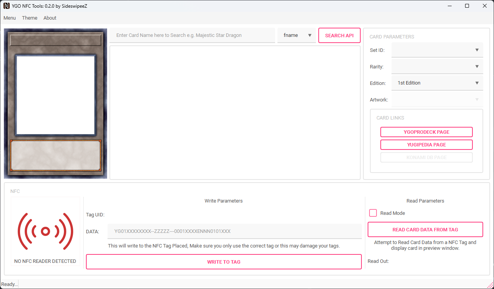

# Yu-Gi-Oh! NFC Reader/Writer




A Yu-Gi-Oh! NFC Reader/Writer application written in Python using PySide6. This tool leverages the [YGOPRODECK API](https://ygoprodeck.com/api-guide/) to query card information, stores the card data in a SQLite database, downloads card images to the local drive, and writes selected card data to NFC NTAG213 tags using an ACR122U NFC reader/writer.

> **DISCLAIMER:** This software is provided "as is" without warranty of any kind. The author is not responsible for any damage to NFC tags, readers, or other hardware that may occur during use. Use at your own risk.

## Features

- **Card Query:** Search for Yu-Gi-Oh! cards using the YGOPRODECK API.
- **Local Database:** Save card details, including image paths, into a SQLite database.
- **Image Download:** Automatically download and store card images locally.
- **NFC Writing:** Write card data to NFC NTAG213 tags using an ACR122U reader/writer.

## Prerequisites

- **Python 3.8+**
- **PySide6** for the graphical user interface
- **qt-material** for the UI styling
- **SQLite3** (bundled with Python) for database management
- **NFC Library** ([pyscard](https://pypi.org/project/pyscard/)) for interfacing with the NFC device
- **Internet Access** for querying the YGOPRODECK API
- **ACR122U NFC Reader/Writer** with proper drivers installed (Tested on Windows 11) or a pyscard compatible reader

## Installation

## Download

### Windows Binary
For users who prefer not to install Python and dependencies, a pre-compiled Windows executable is available, packaged via pyinstaller:

1. Go to the [Releases](https://github.com/SideswipeeZ/ygo-nfc-tools/releases) page on GitHub
2. Download the latest `.zip` or `.exe` file
3. Extract the zip file (if applicable), this is important to load the jsons and db files.
4. Run `exe`

Note: You will still need to install the ACR122U drivers for your NFC reader/writer.

1. **Clone the Repository:**

   ```bash
   git clone https://github.com/SideswipeeZ/ygo-nfc-tools.git
   cd ygo-nfc-tools
   ```

2. **Install the Requirements:**

   ```bash
   pip install -r requirements.txt
   ```

3. **Launch the App:**

   ```bash
   python ygoqt_writer.py
   ```

## Configuration

### YGOPRODECK API
No API key is required; the application accesses public endpoints. BEWARE of too many requests leading to an IP ban from the servers, especially the image server.

### NFC Reader Setup
Confirm that your NFC device drivers are installed and that you have the necessary permissions to access the NFC hardware. 
The NFC icon at the bottom left will be:
- **Blue** if a reader is connected
- **Green** when a tag is detected
- **Red** when there is no hardware detected

### Database
The application uses a local SQLite database (default name: **cards.db**, saved in the same directory as the application).

Each entry has columns as shown below:

1. **card_id**: Passcode of card from YGOPRODECK API
2. **name**: Name of the card in text (Used for searching the DB in Local DB)
3. **json_data**: Saves the raw JSON response from the YGOPRODECK API for that specific card
4. **img_small**: Saves the relative path to the preview image used for this app from the API
5. **image_cropped**: Saves the relative path to the image artwork saved from the API

| card_id | name                     | json_data                        | image_small                    | image_cropped                         |
|---------|--------------------------|----------------------------------|--------------------------------|---------------------------------------|
| 1710476 | Malefic Cyber End Dragon | {"id":1710476, "name":Malef... | cards\small\1710476_small.jpg | cards\small\1710476_cropped.jpg       |

## Usage

### Query Cards
There are two methods to search for cards:

#### 1. API Query (Main Method)
Search for cards by sending a query to the YGOPRODECK API via the dropdown filter. Card details will be saved to JSON, and associated images will be downloaded to your local drive.

You can search using:
- **fname** (Fuzzy Name): Searches all cards that contain the string (name) entered into the search bar
- **name**: Searches for a specific card
- **id**: Searches via the passcode of the card (Passcode is on the bottom left of the actual card)

#### 2. Local Database Search
Access this method via the right-click menu on the list widget or by using **SHIFT+F** on the keyboard (Windows). This method allows searching of cards that include the specified string in the card name.

### Loading Card Data
Once you have cards showing up, click a card from the list widget to load the card's data into memory. Available options will appear based on data from the API. Once a card is loaded into the left preview, you can write to an NFC tag using the controls at the bottom of the UI.

### Working with NFC Tags
This application is designed for NTAG213 tags. The logic should also work for other NTAG2XX tags, though this has not been tested. Please submit an issue/PR for support of additional tags if needed.

#### Reading Tags
- Place an NFC tag on the ACR122U reader
- If the tag already contains card data, it will be loaded into the preview window
- For read-only mode, tick the Read-Only checkbox to continuously read new tags

#### Writing Tags
1. Place an NFC tag on the reader (the NFC logo will turn green and show the reader's name)
2. Select the card you want to write
3. Press "Write to Tag"
4. The console at the bottom will indicate if the write was successful

## Troubleshooting

### OS
- Tested on Windows 11 Pro. Should also work on Mac and Linux, Please open a PR/Issue if you can confirm this.

### NFC Device Issues
- Verify that the ACR122U drivers are installed correctly
- Ensure your user account has permissions to access the NFC device

### API Query Problems
- Check your internet connection
- Confirm that the YGOPRODECK API is operational by visiting their API guide
- You may be temporarily banned if you downloaded too many images at once

### Database Errors
- Ensure that the application has write permissions in its directory

## Contributing
Contributions, bug fixes, and feature requests are welcome. Please open an issue or submit a pull request with your improvements.

A standard for the NFC tag format would be a welcome contribution.

## License
Licensed under the GPL-3.0 license.
See the LICENSE file for details.

## Acknowledgments
- YGOPRODECK API for providing comprehensive Yu-Gi-Oh! card data
- PySide6 for a robust GUI framework
- Pyscard for NFC communication support
- qt-material for Material Design theming
- The open-source community for their ongoing support and contributions